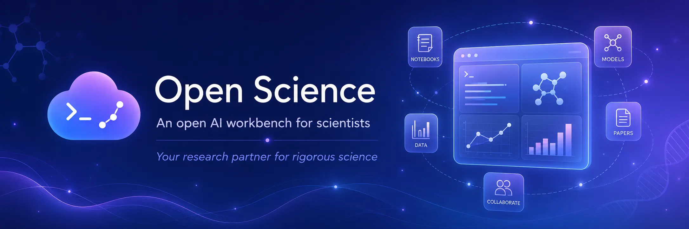
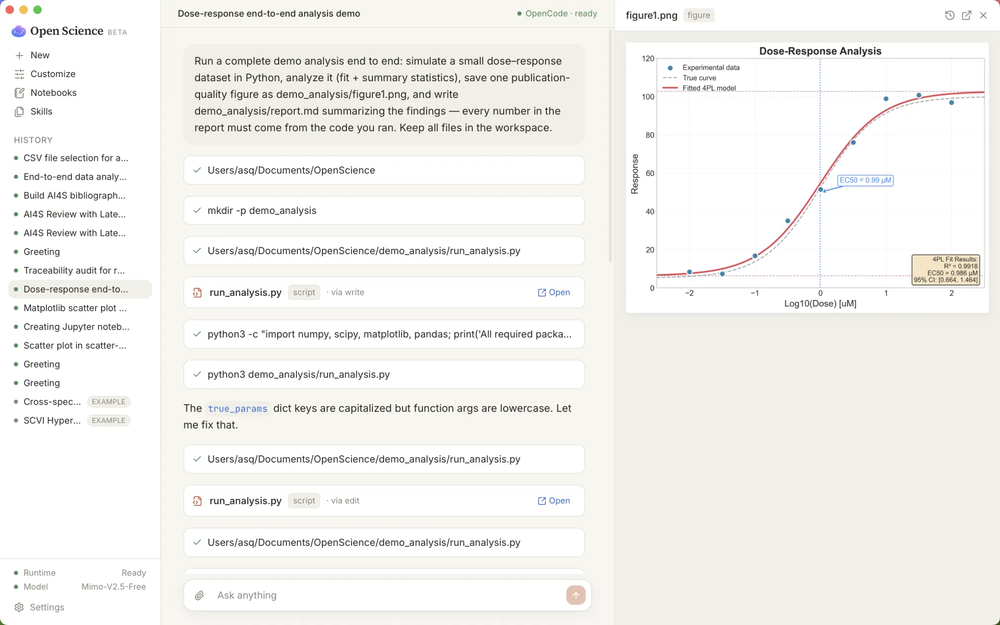
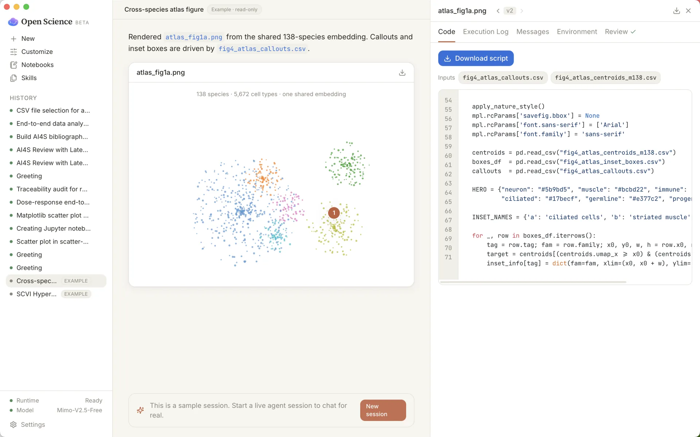
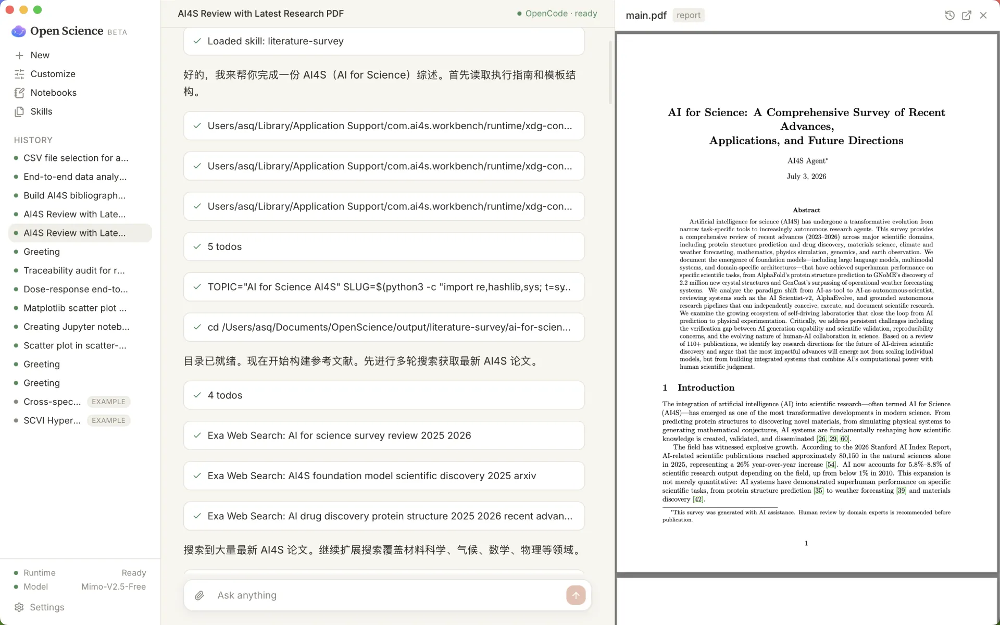
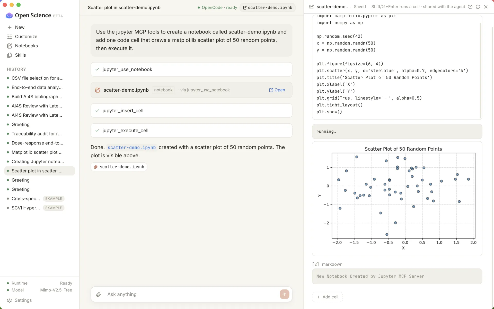
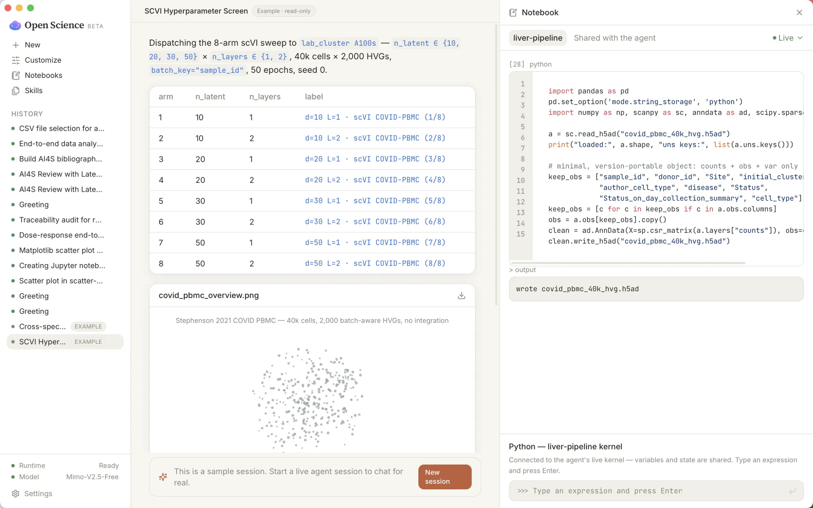
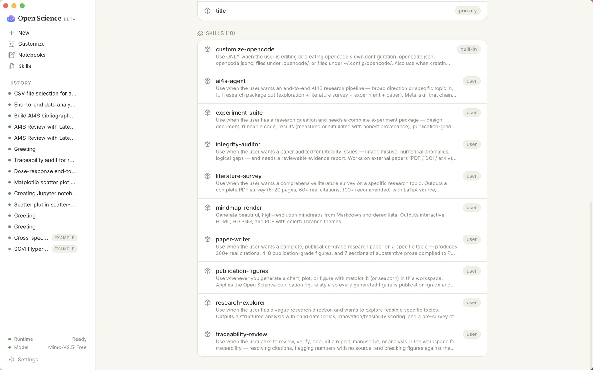

<div align="center">

[](https://github.com/ai4s-research/open-science)

# Open Science Desktop

**macOS、Windows & Linux 向けのローカルファースト、モデル非依存 AI 研究ワークベンチ。**

Formerly Open Science. Claude Science などの AI-for-science ワークベンチに対するオープンソースのデスクトップ代替です。Tauri、MCP、agent skills、再現可能な成果物を基盤に、エージェント、ノートブック、ファイル、図、レポート、実行記録、レビューを 1 つの監査可能なデスクトップワークフローにまとめます。

<p>
  <a href="./README.md">English</a> ·
  <a href="./README.zh.md">简体中文</a> ·
  <b>日本語</b> ·
  <a href="./README.es.md">Español</a> ·
  <a href="./README.de.md">Deutsch</a> ·
  <a href="./README.fr.md">Français</a> ·
  <a href="./README.ko.md">한국어</a>
</p>

<p>
  <a href="./LICENSE"></a>
  <a href="https://internscience.github.io/ResearchClawBench-Home/"></a>
  
  
  
  
  <a href="https://discord.gg/fWNMDKcd5P"></a>
</p>

</div>

---

🎉 **評価:** Open Science Desktop は、自律型科学研究エージェント向けのエンドツーエンドベンチマーク [ResearchClawBench](https://internscience.github.io/ResearchClawBench-Home/) で、採点済みタスク平均スコア第 1 位です（Pass@1 リーダーボード、2026 年 7 月 9 日）。

---

## 目次

- [✨ できること](#できること)
- [🎬 スクリーンショット](#スクリーンショット)
- [🧪 現在の機能](#現在の機能)
- [🔌 スキルとコネクタ](#スキルとコネクタ)
- [📦 インストール](#インストール)
- [🚀 ソースからビルド](#ソースからビルド)
- [🔒 安全性とプライバシー](#安全性とプライバシー)
- [🗂️ リポジトリ構成](#リポジトリ構成)
- [📌 状態](#状態)

## できること

**研究ループをまるごと回す**——広い方向性から完成論文まで:探索、文献調査、仮説、実験コード、分析、作図、執筆を、1 回の連続した監査可能なセッションで。

- **自律型リサーチエージェント**: バンドルされた `ai4s-agent` が専門スキルをエンドツーエンドで連結し(探索 → 調査 → 実験 → 執筆)、各ステップが単なるチャット返信ではなく、実在する検査可能な成果物をワークスペースに残します。
- **すべてが辿れる**: 図、表、レポート、ノートブック、実行出力は、それらを生成した正確なコード、入力、環境、モデル出力、会話へリンクします。
- **ローカルファースト、あなたのもの**: セッション、データ、来歴、ノートブック、実行記録はすべて手元のローカルフォルダに保存され、既定では外部に出ません。
- **モデル非依存ランタイム**: UI は `packages/sdk` 経由でバンドル済み OpenCode sidecar と通信します——好きなモデルを持ち込めます。プロバイダ、スキル、MCP サーバーは差し替え可能です。
- **設計から再現可能**: ローカル、SSH/Slurm、Modal、notebook-batch の実行を、散らばった端末ログではなく再現可能な run record として記録します。
- **拡張可能**: エージェントスキル、MCP サーバーとワンクリックの科学コネクタ、`/` コマンド、`!` shell モード、そしてモデル非依存の SDK。

## スクリーンショット







<details>
<summary><b>その他のスクリーンショット</b></summary>

<br>







</details>

## 現在の機能

**研究ループをスキルとして。** 1 つのメタスキルがパイプライン全体を実行し、各ステージは自己完結したスキルとして、実在する評価可能な成果物を生成します——OpenCode が対応する任意のモデルで動きます:

| スキル | 役割 | 主な成果物 |
| --- | --- | --- |
| `ai4s-agent` | 下の 4 スキルを順に実行 | 研究パッケージ一式 |
| `research-explorer` | 広い方向性を具体的なテーマへ収束 | `research_exploration.md`、`topic_matrix.md`、`literature_pre_survey.md` |
| `literature-survey` | 文献調査を執筆 | 6–20 頁 PDF、60+ の実引用、LaTeX ソース、分類図 |
| `experiment-suite` | 実験パッケージを構築 | 設計文書、実行可能コード、来歴付き `results.json`、図、レポート |
| `paper-writer` | 研究論文を執筆 | 8–14 頁 PDF、200+ 引用、4–8 図、表 |
| `mindmap-render` | マインドマップを描画 | `topic_matrix.md` から生成した画像 |
| `integrity-auditor` | 論文の整合性を監査 | 画像/数値/論理の指摘、4 段階の証拠グレーディング、`audit_report.md` |

これらは `ai4s-skills` パックとして、第一者のレビュースキルおよび下記の Office/ドキュメントスキルとともに提供されます。

### プラットフォーム

| 領域 | 現在の状態 |
| --- | --- |
| デスクトップ | Tauri 2 + React + TypeScript + Vite。macOS、Windows、Linux のビルド対象。 |
| ランタイム | アプリが自動起動するバンドル済み OpenCode sidecar。ユーザー自身の OpenCode 設定/データとは分離。 |
| セッション | 複数セッション、履歴、日時付きワークスペース、全ワークスペース履歴、`/` コマンド、`!` shell モード。 |
| ファイル | グローバル/セッション内のファイルブラウズ、右クリック操作、外部アプリで開く、パスコピー、ローカルプレビューサーバー。 |
| ノートブック | 実際の `.ipynb`、Python/R ノートブック作成、ローカルカーネル実行、バンドル `uv` による Jupyter 環境、JupyterLab 起動。 |
| 実行記録 | 追記型 run log、グローバル SQLite インデックス、検索/ファセット/ページング、出力リンク、ログ、再現プロンプト。 |
| 来歴 | `.openscience/provenance.jsonl` がファイル版を記録し、成果物を作成元の実行または編集へ結びます。 |
| ビューア | PDF、画像、動画、HTML、Markdown、コード、CSV/TSV とチャート、DOCX、XLSX、PPTX、分子、3D mesh、ゲノム、FITS、DOS/DOSCAR、EIGENVAL bands、qcode、異常マップ、phase。 |
| UI 言語 | English、简体中文、日本語、Español、Deutsch、Français、한국어。Portuguese (Brazil) と Arabic は登録済みですが、まだ選択可能ではありません。 |

## スキルとコネクタ

ビルド時に `ai4s-skills`、`anthropics/skills` の `docx`/`pdf`/`pptx`/`xlsx`、および `runtime/skills/core/` の第一者スキルを取得します。コアスキルには `traceability-review`、`stats-integrity`、`domain-check`、`large-file`、`publication-figures`、`remote-compute`、`modal-run` が含まれます。

ワンクリック科学 MCP コネクタ: 文献検索、Biomedical databases、Materials Project、FRED、Space weather、Open-Meteo、USGS water data。任意のローカル/リモート MCP サーバーも Settings から追加できます。

## インストール

[Releases](https://github.com/ai4s-research/open-science/releases/latest) から最新版をダウンロードしてください。

- **macOS**: `.dmg` / `.app`、Apple Silicon と Intel、macOS 13 Ventura 以降。
- **Windows**: NSIS `.exe` と `.msi`、Windows 10/11 x64。
- **Linux**: x86_64 Linux 向け `.deb` と `.rpm`。

まだコード署名/Notarization はありません。macOS でブロックされた場合:

```bash
xattr -cr "/Applications/Open Science.app"
```

Windows では SmartScreen の **More info -> Run anyway** を選択します。

## ソースからビルド

```bash
git clone https://github.com/ai4s-research/open-science
cd open-science
pnpm install
bash scripts/dev/fetch-opencode.sh
bash scripts/dev/fetch-uv.sh
bash scripts/dev/fetch-skills.sh
pnpm --filter @ai4s/desktop tauri dev
pnpm --filter @ai4s/desktop tauri build
```

チェック:

```bash
pnpm test
pnpm typecheck
pnpm lint
```

## 安全性とプライバシー

ワークスペース、元データ、会話履歴、来歴、ノートブック、実行記録は既定でローカルに残ります。コマンド実行、削除、依存関係インストール、リモート接続は人間の承認を通ります。認証情報はアプリ専用ランタイム設定に保存され、ワークスペース、来歴、git、エクスポート、グローバル OpenCode 設定には入りません。

## リポジトリ構成

| パス | 用途 |
| --- | --- |
| `apps/desktop/` | Tauri + React デスクトップアプリ。 |
| `packages/sdk/` | `OpenCodeClient`。UI が OpenCode を直接呼ばないための層。 |
| `packages/shared/` | 共有型とチャートパレット。 |
| `runtime/skills/core/` | 第一者科学スキル。 |
| `runtime/skills/external/` | ビルド時取得の外部スキル。 |
| `examples/` | 内蔵サンプルワークスペース。 |
| `scripts/dev/` | sidecar、`uv`、スキル取得、回帰プローブ。 |
| `docs/` | 製品、技術、operator、コネクタ、研究メモ。 |

## 状態

現在の実装ログは [`PROGRESS.md`](./PROGRESS.md) を参照してください。近い作業は署名済みリリース、Windows/Linux 検証、自動更新、コネクタの堅牢化、再現性レビューの継続です。議論には [Open Science Discord](https://discord.gg/fWNMDKcd5P) も使えます。

[MIT](./LICENSE). Open Science Desktop は beta の研究ツールです。出力は草稿として扱い、公開や意思決定の前に数字、引用、コード、結論を検証してください。
